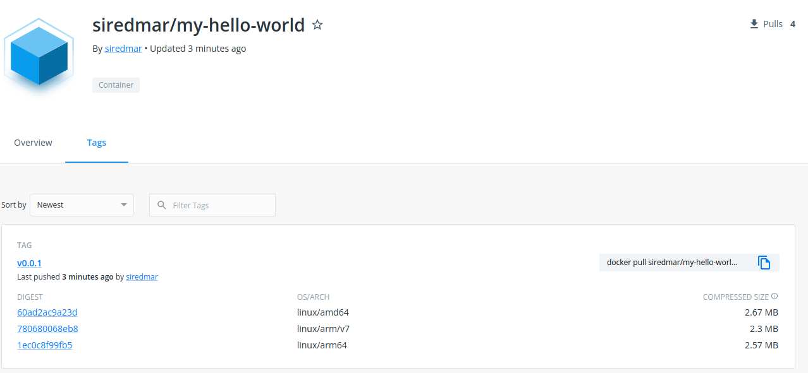

# Basic Containers Training

Welcome! Here you will find everything that is needed for this course.

In this training we will talk about the very `basics` of containers like:

* what is a `container`?
* how do they work?
* how do i interact with containers?
* what is the difference between `container images` and `containers`?
* does it even `compare` to a `virtual machine`?

---

We will also take a deeper look at some topics on `managing` container images:

* how do i `start and stop` my containers?
* how do i `build` my own containers?
* how do i `store and share` my own container `images`?

---

We will also take a deeper look at some `technical stuff`:

* what are the most popular container runtimes
* how do i let my container `use` or `provide` `resources` like ports or devices?
* i'm running on ARM. How do i cross-compile my images?

Many sections in this training are coupled with examples. 
Feel free to try everything out. It is always a good idea to explore for yourself.

So let's start then!

---
# Prerequisites

Wait! Before we begin there are some actions to take.

If you want to follow along and try for yourself you can use a local installation of a container runtime e.g. `docker`. Follow the linked instructions on [how to install docker](https://docs.docker.com/get-docker/).
If you don't want or can't install `docker` locally, please make sure that you signed up for a free account on https://github.com and https://gitpod.io. Using `gitpod` you can also follow along all examples in your web browser. The browser plugin for gitpod is highly recommended as you can simply create an gitpod instance from an github repository -> [Gitpod browser extension](https://www.gitpod.io/docs/browser-extension).

---
Prepare a free account at https://docker.io for uploading your custom docker images.

In this training all examples refer to `docker` - however many other popular container runtimes are pretty compatible in usage to `docker` like `crictl`, `podman`, `nerdctl`, ...
If you feel adventurous use whatever container runtime you want. If you want to stay safe stick with `docker`.

---

# Basics

We'll start with the absolute basics before jumping in and do cool stuff.

---
## Before we start

Did you have any contact with the world of containers yet?
Have you ever used containers or docker before?

**Tell us!**

---
## What is a `container` and how does it work?

**A container is a standard unit of software that packages up code and all its dependencies so the application runs quickly and reliably from one computing environment to another.**

Container runtimes use a technology called `namespaces` in the Linux kernel to provide the isolated workspace called the container. When you run a container, the runtime creates a set of namespaces for that container.

These namespaces provide a layer of isolation. Each aspect of a container runs in a separate namespace and its access is limited to that namespace.

---
**Wait, what does that mean in the language of simple people?**


Image source [docker.com](https://www.docker.com/resources/what-container/)

---

The container runtime (today it's docker) runs on the host sharing the same infrastructure. Docker then runs the applications that are encapsulated in containers `App A` - `App F`. The running containers share the same underlying Linux Kernel. This means the application does not bring it's own kernel. It just brings what the application needs to run in terms of libraries, dependencies and so on. Each application can be configured to access a limited amount of CPU or RAM resources.

---
**In short, what are the advantages containers bring to us?**

1. All the applications dependencies are packed up in one simple thing that can be easily versioned and shared.
2. If you've build a container image and it runs well on your machine, you can be absolutely sure that this will just work fine on another machine (depending on the CPU architecture).
3. There is no runtime overhead. Processes within the container are handeled by the hosts Linux kernel.
4. The container image brings its own root filesystem. Is does not matter which Linux distribution runs the container.
---
## How do i interact with containers?

Assuming you are running docker you can simply start a command shell on your PC. Assuming from now on that you are using linux.

Running the `docker --help` command gives various help what you can do.

```sh
$ docker --help

Usage:  docker [OPTIONS] COMMAND
...
```

---
Just to name a few docker commands:  
* ps (list curtently running)
* run (instanciates a new container)
* build (builds a new container image)
* push (pushes a locally present image to a container registry)
* pull (pulls a remote present image from a container registry)
* rm (deletes containers)

There many more options. But we will take a closer look later on in this training.

---

## What is the difference between `container images` and `containers`?

Simple: the container is a running instance of an image

You can instanciate as many containers from the same image as you like.
So you are not distributing a container, but a container image.

---
## Does it even `compare` to a `virtual machine`?

No, not really. Virtual machines bring a bunch of CPU and memory resources, have their own operating system running an provide a own Linux kernel. The container however shares a bunch of resources like CPU, Memory, disk, Linux kernel and so on. 

Head over to [this external link for a deeper comparison](https://www.netapp.com/blog/containers-vs-vms/)  if you like.

---
## What's the big picture in terms of `docker`?


Image source: [k21academy.com](https://k21academy.com/docker-kubernetes/docker-tutorial/)

---
The container `registry` is a place where you can upload your images and provide access for people to pull them too. Popular ones are [Docker Hub](https://hub.docker.com) or the [github container registry](https://github.com/features/packages). They both offer free plans.

The `client` builds, pushes, pulls and runs images. That's you making the calls what to do.

The `DOCKER_HOST` can be running on the same local machine the client does stuff. However, it can also be some remote machine. The docker daemon performs the action, e.g. it pulls an image from the registry and runs it with parameters the client passed.

---

## The lifecycle of a container


---

## Microservices everywhere

What is a microservice?

Image source: [BMC](https://www.bmc.com/blogs/microservices-architecture/)

---

# Let's dig into the usage!

---

## The `docker run` command

```sh
$ docker run hello-world
Unable to find image 'hello-world:latest' locally
latest: Pulling from library/hello-world
2db29710123e: Pull complete 
Digest: sha256:13e367d31ae85359f42d637adf6da428f76d75dc9afeb3c21faea0d976f5c651
Status: Downloaded newer image for hello-world:latest

Hello from Docker!
This message shows that your installation appears to be working correctly.

To generate this message, Docker took the following steps:
 1. The Docker client contacted the Docker daemon.
 2. The Docker daemon pulled the "hello-world" image from the Docker Hub.
    (amd64)
 3. The Docker daemon created a new container from that image which runs the
    executable that produces the output you are currently reading.
 4. The Docker daemon streamed that output to the Docker client, which sent it
    to your terminal.
...
```
---

Let's jump to https://hub.docker.com and take a quick look. Here you will find plenty already ready to run container images. 
Most popular open source projects share their container images on Docker Hub, while others are published by individuals. Some are excellent in quality, some are very poor. You always should check what's inside an image before running it.

Let's take a look at some examples how and with which options containers can be started.

---

## Starting and stopping containers

Containers can be started and stopped.

```sh
$ docker run -d --name nginx nginx
$ docker ps
CONTAINER ID   IMAGE   COMMAND                  CREATED         STATUS                      PORTS   NAMES
e02973326361   nginx   "/docker-entrypoint.…"   5 seconds ago   Up 3 seconds                80/tcp  nginx
$ docker stop nginx
$ docker ps
CONTAINER ID   IMAGE  COMMAND                   CREATED         STATUS                      PORTS   NAMES
92715dfd8824   nginx  "/docker-entrypoint.…"    9 seconds ago   Exited (0) 4 seconds ago            nginx
$ docker start nginx
$ docker ps
CONTAINER ID   IMAGE   COMMAND                  CREATED         STATUS                      PORTS   NAMES
e02973326361   nginx   "/docker-entrypoint.…"   55 seconds ago  Up 3 seconds                80/tcp  nginx
$ docker stop nginx
# delete the container
$ docker rm nginx
```
---

## Examples for different `docker run` options

In this section you will find several examples that shows how containers can be started with different options. 
Note that all those options can be combined.
See `docker run --help ` for a complete list of supported options. For this training we will take a look at the very basic and often needed sections.

---

### Environment variables for containers

```sh
$ docker run --rm --env FOO=bar bash env
HOSTNAME=f71a3329d8c4
PWD=/
_BASH_BASELINE_PATCH=16
FOO=bar
HOME=/root
_BASH_VERSION=5.1.16
_BASH_BASELINE=5.1.16
_BASH_LATEST_PATCH=16
SHLVL=0
PATH=/usr/local/sbin:/usr/local/bin:/usr/sbin:/usr/bin:/sbin:/bin
```
---
### Bind Mounts
```sh
# This is the hosts hostname. No containers involved here.
$ cat /etc/hostname
devbox

# Read from host
$ docker run --rm --volume /etc/hostname:/hosts-hostname bash cat /hosts-hostname
devbox

# Write to host
$ echo foo > /tmp/host/writefile
$ docker run -it --rm --volume /tmp/host/writefile:/writefile bash
 $ echo bar > /writefile
 $ exit
$ cat /tmp/host/writefile
bar

# Volume is read only. write to host fails.
$ docker run -it --rm --volume /etc/hostname:/hosts-hostname:ro bash
 $ echo foo > /hosts-hostname
bash: /hosts-hostname: Read-only file system
```

---

### Ports

Start daemonized nginx which is reachable on host port 1234

```sh
$ docker run -d --rm -p 1234:80 --name nginx nginx 
ea2e446129148ffd48744c9589b0240a0b6c591c7ffa17403bee23d10a2ee7c5
$ docker ps
CONTAINER ID  IMAGE  COMMAND                CREATED        STATUS       PORTS                                  NAMES
ea2e44612914  nginx  "/docker-entrypoint.…" 2 seconds ago  Up 1 second  0.0.0.0:1234->80/tcp, :::1234->80/tcp  nginx
$ curl localhost:1234
<!DOCTYPE html>
<html>
...
<p>If you see this page, the nginx web server is successfully installed and
working. Further configuration is required.</p>
...
</html>
$ docker kill nginx
nginx
$ docker ps
CONTAINER ID  IMAGE  COMMAND CREATED  STATUS  PORTS  NAMES
```
---

## Networking

There are several network modes, but we will discuss only two of them today:

* bridge network
* host network
---

### Bridge network

Containers can communicate with each other using a network. 

TL;DR

* For containers to communicate with other, they need to be part of the same “network”.
* Docker creates a virtual network called `bridge` by default, and connects your containers to it.
* In the network, containers are assigned an IP address, which they can use to address each other.
* If you want more control (and you definitely do), you can create a user-defined bridge, which will give you the added benefit of hostnames for your containers too.
---

### Example bridge networking

Lets create a network and let two containers talk to each other via the network `mynetwork`.
Note, that the `curl` container can resolve by the container name `nginx`.

```sh
$ docker network create mynetwork
$ docker run --rm -d --net mynetwork --name nginx nginx
$ docker run --rm --net mynetwork --name curl curlimages/curl -s http://nginx
<!DOCTYPE html>
<html>
...
<p>If you see this page, the nginx web server is successfully installed and
working. Further configuration is required.</p>
...
</html>
$ docker kill nginx
$ docker network rm mynetwork
```
---

### Host network

A container can be part of the hosts network. This means if the container is in the host network and binds a port, it will be bound on the host.

Example:

```sh
$ docker run -d --rm --net host nginx
$ curl localhost:80
...
```
---

## Volumes

A modified containers filesystem is not persisted if the container will be removed. It's all gone.
Volumes can be used to work around this and keep files alive during container restarts.

TL;DR

* A bind mount uses the host file system, but Docker volumes are native to Docker. 
* The data is kept somewhere on storage attached to the host – often the local filesystem. 
* The volume itself has a lifecycle that's longer than the container's, allowing it to persist until no longer needed. Volumes can be shared between containers.
* In some cases, the volume is in a form that is not usable by the host directly.
---

### Volumes example

Let's create a volume and let a container use it.

```sh
$ docker volume create myvolume
myvolume
$ docker volume ls
DRIVER    VOLUME NAME
local     myvolume
$ docker run --rm -v myvolume:/data bash bash -c "echo data1 > /data/file"
$ docker run --rm -v myvolume:/data bash bash -c "cat /data/file"
data1
```
---

Let's inspect and delete the volume

```sh
$ docker inspect myvolume
[
    {
        "CreatedAt": "2022-07-12T22:52:55+02:00",
        "Driver": "local",
        "Labels": {},
        "Mountpoint": "/var/lib/docker/volumes/myvolume/_data",
        "Name": "myvolume",
        "Options": {},
        "Scope": "local"
    }
]

$ docker volume rm myvolume
myvolume
```

---

# docker build

Using `docker build`, you can build a Dockerfile to a container image.
Lets have a look what we can do here.

---
## `Dockerfile` explained

First off, visit the [Dockerfile reference](https://docs.docker.com/engine/reference/builder/) for an in depth view of the whole truth.

tl;dr Dockerfiles consist of directives. The most useful are listed below and are helpful as a reference. However we will talk about them explaining the examples.

---
### FROM

Must be the first non-comment line in a Dockerfile. 
It references the image your image is based on, called `base image`.
It can appear multiple times within one Dockerfile to define different sections during the build.

Usage: 
```sh
FROM <image>
FROM <image>:<tag>
FROM <image> --as <name>
```

---

### RUN

Is used to run commands.
Each RUN creates a new layer that is part of your docker image.

Usage: 
```sh
RUN <cmd>
RUN <cmd1> && \
    <cmd2>
```
---

### ENV

Is used to define environment variables to the image.
Can be combined with ARG.

Usage: 
```sh
ENV <key> <value>
ENV <key>=<value>
```
---
### ARG

Is used as a build argument. Can be used to control behavior during the build of the image.
Defines a variable that users can pass at build-time to the builder with the docker build command using the --build-arg <varname>=<value> flag
Multiple variables may be defined by specifying ARG multiple times.
Environment variables defined using the ENV instruction always override an ARG instruction of the same name.

Usage: 
```sh
ARG <key>[=<default value>]
```
---
### WORKDIR

Sets the working directory for any RUN, CMD, ENTRYPOINT, COPY, and ADD instructions that follow it.
It can be used multiple times in the one Dockerfile. If a relative path is provided, it will be relative to the path of the previous WORKDIR instruction.

Usage: 
```sh
WORKDIR </path/to/workdir>
```
---

### ENTRYPOINT

Allows you to configure a container that will run as an executable.
Command line arguments to docker run <image> will be appended after all elements in an exec form ENTRYPOINT and will override all elements specified using CMD.
The shell form prevents any CMD or run command line arguments from being used, but the ENTRYPOINT will start via the shell. This means the executable will not be PID 1 nor will it receive UNIX signals. Prepend exec to get around this drawback.
Only the last ENTRYPOINT instruction in the Dockerfile will have an effect.

```
ENTRYPOINT ["<executable>", "<param>", ...]
```

---

### CMD

The main purpose of a CMD is to provide defaults for an executing container. These defaults can include an executable, or they can omit the executable, in which case you must specify an ENTRYPOINT instruction as well.
There can only be one CMD instruction in a Dockerfile. If you list more than one CMD then only the last CMD will take effect.
If CMD is used to provide default arguments for the ENTRYPOINT instruction, both the CMD and ENTRYPOINT instructions should be specified with the JSON array format.
If the user specifies arguments to docker run then they will override the default specified in CMD.
Normal shell processing does not occur when using the exec form. For example, CMD ["echo", "$HOME"] will not do variable substitution on $HOME.

```
CMD ["<executable>", "<param>", ...]
CMD ["<param>", ...] (as default parameters to ENTRYPOINT)
```
---

### COPY 

Copies new files or directories and adds them to the filesystem of the image at the path <dest>.
<src> may contain wildcards and matching will be done using Go’s filepath.Match rules.
If <src> is a file or directory, then they must be relative to the source directory that is being built (the context of the build).
<dest> is an absolute path, or a path relative to WORKDIR.
If <dest> doesn’t exist, it is created along with all missing directories in its path.

```
COPY <src> [<src> ...] <dest>
```

---

### ADD

The same as `COPY`, but src can also be a remote URL.

```
ADD <src> [<src> ...] <dest>
```

---
## Examples

Lets inspect some examples and talk about them.

---
### examples/my-hello-world

`docker build [options] -t <name> <context>`

```
FROM alpine
ENTRYPOINT [ "sh", "-c", "echo hello world from $(uname -m)"]
```

```sh
$ cd examples/my-hello-world
$ docker build -t my-hello-world:latest .
$ docker run --rm my-hello-world:latest
hello world from x86_64
```
---
### examples/args

Using one single Dockerfile that can be parameterized using `build-args`.
`docker build [options] -t <name> --build-arg <key>=<value> <context>`

```
ARG IMAGE=bash
ARG TAG=latest
FROM ${IMAGE}:${TAG}
ARG IMAGE=bash
ARG TAG=latest
ENV VERSION=${IMAGE}:${TAG}
```
---

```
$ cd examples/args

$ docker build -t mybash:latest .
$ docker run --rm mybash:latest env | grep -E -i '^VERSION'
VERSION=bash:latest

$ docker build -t myalpine:3.15 --build-arg IMAGE=alpine --build-arg TAG=3.15 .
$ docker run --rm myalpine:3.15 env | grep -E -i '^VERSION'
VERSION=alpine:3.15

$ docker build -t mybash:5.1.16 --build-arg TAG=5.1.16 .
$ docker run --rm mybash:5.1.16 env | grep -E -i '^VERSION'
VERSION=bash:5.1.16
```
---
### examples/cmd

Default command can be overridden.
`docker run [options] <image> [cmd]`

```
FROM bash:latest
CMD [ "-u" ]
ENTRYPOINT [ "date" ]
```

```
$ cd examples/cmd
$ docker build -t cmd:latest .

$ docker run --rm cmd
Tue Jul 12 19:39:45 UTC 2022

$ docker run --rm cmd +%d.%m_%H:%M -d @$(($(date +%s)))
12.07_19:39
```
---

### example/my-html-server

Simple Dockerfile which is a little less useless than the others. Builds and packs up a custom application.

```
FROM golang:1.18.3-alpine3.16
COPY main.go /src/main.go
COPY go.mod /src/go.mod
WORKDIR /src
RUN go build -o /app
ENTRYPOINT [ "/app"]
```

```
$ cd examples/my-html-server
$ docker build -t my-html-server:latest .
$ docker run -d --rm -p 8080:8080 --name my-html-server my-html-server:latest
dc74ba584b345e98986ae307c966af7b9cfad3bca83587d1d3e2f7b12847297c
$ curl localhost:8080/hello_world
Hello, hello_world
$ docker kill my-html-server:latest
my-html-server
```

---

Cool! But wait, we've got a problem: the image is really big

```sh
$ go build -o app
$ ls -lh app
-rwxrwxr-x 1 user user 6,0M Jul 13 11:10 app

$ docker images my-html-server
REPOSITORY       TAG       IMAGE ID       CREATED        SIZE
my-html-server   latest    6611934b6447   1 minute ago   334MB
```

---

### example/multi-staged-build

A multistaged build is useful when you don't want to reuse your Dockerfile to build other projects.

```
FROM alpine:3.16 as builder

RUN apk add g++ make
COPY src /app/src
COPY Makefile /app
WORKDIR /app
RUN make

FROM alpine:latest
COPY --from=builder /app/static /static
CMD [ "/static" ]
```

```
$ docker build -t multi-staged-build:0.1.0-beta.1 .
$ docker run --rm multi-staged-build:0.1.0-beta.1               
Link statically please
```
---

```sh
$ docker images multi-staged-build:0.1.0-beta.1
REPOSITORY           TAG            IMAGE ID       CREATED        SIZE
multi-staged-build   0.1.0-beta.1   8eaeedcc195b   1 minute ago   11.7MB
```


---

### example/build-container

If you have similar projects that can be build pretty much the same, you can use a builder image.
The builder image can be used then to start a container that builds the project. The source and build artifacts are mounted on the hosts filesystem. 
Once the builder container has compiled the project, the application image can be built copying the build artifacts.

The `Dockerfile.builder` adds a G++ compiler and make to a basic alpine base image.

```
FROM alpine:3.16 as builder

RUN apk add g++ make
WORKDIR /app
```

---

Let's build our builder image and compile the application using this builder image.

```sh
$ make builder-image
docker build -t builder:latest -f Dockerfile.builder .
...
$ make containerized-build-app
docker run --rm -v /work/docker-training/examples/build-container:/app builder:latest make
g++ -static src/main.cpp -o out/static

$ ls -l out/
total 2,3M
-rwxrwxr-x 1 user user 2,3M Jul 12 23:39 static
```

---

Lets use our artifact that has been previously build and is located in `out/`.
Build the image containing the application and run it using this `Dockerfile.application`.

```
FROM alpine:latest
COPY out/static /static
CMD [ "/static" ]
```

---

```

$ make build-application-image
docker build -t static:latest -f Dockerfile.application .
Sending build context to Docker daemon  6.197MB
Step 1/3 : FROM alpine:latest
 ---> e66264b98777
Step 2/3 : COPY out/static /static
 ---> fa97c34b0954
Step 3/3 : CMD [ "/static" ]
 ---> Running in 9fb5b6b39386
Removing intermediate container 9fb5b6b39386
 ---> a0753d1ed0e7
Successfully built a0753d1ed0e7
Successfully tagged static:latest

$ docker images static:latest                  
REPOSITORY   TAG       IMAGE ID       CREATED        SIZE
static       latest    a0753d1ed0e7   12 hours ago   11.7MB

$ docker run --rm static:latest
Link statically please
```

---

# Naming and versioning of images

So far we've often seen something like `nginx:latest`, or `alpine:3.16`. This is the identifier of the container image.
The format is `<name>:<tag>`.

Examples: 
* `alpine:3.16`
* `myuser/myimage:1.2.4`
* `docker.io/myuser/myimage:1.2.4`
* `ghcr.io/edgefarm/anck:0.2.0-beta.1`

---

# Pushing and Pulling images
---
## Pulling
You can pull container images from a container registry like the `Docker Hub`.

`docker pull <IMAGE>[:TAG]`

```sh
$ docker images
REPOSITORY  TAG            IMAGE ID       CREATED         SIZE
$ docker pull nginx:1.23.0-alpine
1.23.0-alpine: Pulling from library/nginx
2408cc74d12b: Already exists 
dd61fcc63eac: Pull complete 
f9686e628075: Pull complete 
ceb5504faee7: Pull complete 
ce5d272a5b4f: Pull complete 
136e07b65aca: Pull complete 
Digest: sha256:8e38930f0390cbd79b2d1528405fb17edcda5f4a30875ecf338ebaa598dc994e
Status: Downloaded newer image for nginx:1.23.0-alpine
docker.io/library/nginx:1.23.0-alpine
```
---

```
# List all images
$ docker images
REPOSITORY  TAG            IMAGE ID       CREATED         SIZE
nginx       1.23.0-alpine  f246e6f9d0b2   2 weeks ago     23.5MB
# List all image with intermediate images
$ docker images --all
REPOSITORY   TAG     DIGEST   IMAGE ID      CREATED       SIZE
<none>       <none>  <none>   fa97c34b0954  11 hours ago  11.7MB
static       latest  <none>   a0753d1ed0e7  11 hours ago  11.7MB
builder      latest  <none>   1f646257efe6  11 hours ago  185MB
<none>       <none>  <none>   1abb922c546c  11 hours ago  191MB
...
```
---

You also can push images to a docker registry. If you are using docker, then you first have to use `docker login` to authenticate with the Docker Hub.

TL;DR

```sh
$ docker login
$ docker images
REPOSITORY      TAG            IMAGE ID       CREATED         SIZE
myuser/myimage  1.0.0          1acc222c578c   2 hours ago     123MB
$ docker push myuser/myimage:1.0.0
```
---

You also can also re-tag images
`docker tag <SOURCE_IMAGE>[:TAG] <TARGET_IMAGE>[:TAG]`

```sh
$ docker pull nginx:1.23.0-alpine
$ docker tag nginx:1.23.0-alpine myuser/nginx:myversion
$ docker push myuser/nginx:myversion
```
---


# Exercise

1. Write a `Dockerfile` and `build` a container image that contains the application `exercise/webserver-volume-access`. Follow the `exercise/webserver-volume-access/README.md` on how to build the application.
Make sure the resulting image is as `small as possible`!
2. `Run` the container so, that the container has the following characteristics:

* let the internal container port `8080` be accesible at the hosts port `9090`.
* give the container access to the hosts file `exercise/webserver-volume-access/input` in containers filesystem at `/app/input`.

see next site...

---

3. Test your setup by updating the input file. After requesting the application the new values shall be printed.

```sh
$ echo "hello world" > examples/webserver-volume-access/input
$ curl localhost:9090
hello world
$ echo "I am standing on the moon" > examples/webserver-volume-access/input
$ curl localhost:9090
I am standing on the moon
```
---
Questions on the exercise? 
* All questions answered?
* **Do it!** We will meet again in 10 minutes.

---

**There are millions of right solutions, but here is one.**

```
FROM golang:1.18.3-alpine3.16 as builder

RUN  apk add make
WORKDIR /app
COPY go.mod /app/go.mod
COPY main.go /app/main.go
COPY Makefile /app/Makefile
RUN make

FROM scratch
COPY --from=builder /app/webserver-volume-access /webserver-volume-access
ENTRYPOINT ["/webserver-volume-access", "-i", "/app/input"]
```
---

Let's see it in action

```sh
$ cd exercise/webserver-volume-access
$ base64 -d Dockerfile.solution > Dockerfile
$ docker build -t webserver-volume-access:latest .

$ docker images webserver-volume-access:latest
REPOSITORY                TAG       IMAGE ID       CREATED        SIZE
webserver-volume-access   latest    53b1241109e3   22 hours ago   6.28MB

$ echo "hello world" > input

$ docker run -d --rm -p 9090:8080 -v $(pwd)/input:/app/input --name webserver-volume-access webserver-volume-access:latest

$ curl localhost:9090
hello world

$ echo "I am standing on the moon" > input

$ curl localhost:9090
I am standing on the moon

$ docker kill webserver-volume-access
```

---


# Cross compiling for different CPU architectures

If you want to build a container image for a differen CPU architecture you can do it two ways:

1. compile on the real target hardware
2. emulate the target hardware and build on any x86 hardware you like.

Now we are focusing on emulating the target hardware.

---

## Docker buildx

There are several ways to build so called multi-arch container images. One way is `docker buildx`.
See the full reference [here](https://docs.docker.com/engine/reference/commandline/buildx_build/).

TL;DR

* buildx is a CLI plugin for `docker` 
* builds multiple docker images. One for each CPU architecture.
* can be exported or pushed directly to the registry
* can NOT be used with `docker images` or `docker run`

---

## Example

First off, qemu must be installed. Run
`docker run --rm --privileged multiarch/qemu-user-static --reset -p yes`

```
$ cd examples/my-hello-world

$ docker buildx create  --name mycrossbuilder --platform linux/amd64,linux/arm64,linux/arm/v7
mycrossbuilder
$ docker buildx ls
NAME/NODE                 DRIVER/ENDPOINT             STATUS   PLATFORMS
mycrossbuilder            docker-container                     
  mycrossbuilder0         unix:///var/run/docker.sock inactive linux/amd64*, linux/arm64*, linux/arm/v7*
$ docker buildx inspect mycrossbuilder --bootstrap
[+] Building 2.9s (1/1) FINISHED                                                                                                                                                                           
 => [internal] booting buildkit                                                                                                                                                                       2.9s
 => => pulling image moby/buildkit:buildx-stable-1                                                                                                                                                    2.1s
 => => creating container buildx_buildkit_mycrossbuilder0                                                                                                                                             0.8s
Name:   myCrossBuilder
Driver: docker-container

Nodes:
Name:      mycrossbuilder0
Endpoint:  unix:///var/run/docker.sock
Status:    running
Platforms: linux/amd64*, linux/arm64*, linux/arm/v7*, linux/amd64/v2, linux/amd64/v3, linux/riscv64, linux/ppc64le, linux/s390x, linux/386, linux/mips64le, linux/mips64, linux/arm/v6
```
---
```
$ docker buildx use mycrossbuilder

$ docker login

$ docker buildx build -t myuser/my-hello-world:v0.0.1 . --push --platform linux/amd64,linux/arm64,linux/arm/v7
[+] Building 9.1s (11/11) FINISHED                                                                                                                                                                         
 => [internal] load .dockerignore                                                                                                                                                                     0.4s
 => => transferring context: 2B                                                                                                                                                                       0.0s
 => [internal] load build definition from Dockerfile                                                                                                                                                  0.3s
 => => transferring dockerfile: 111B                                                                                                                                                                  0.0s
 => [linux/amd64 internal] load metadata for docker.io/library/alpine:latest                                                                                                                          4.4s
 => [linux/arm/v7 internal] load metadata for docker.io/library/alpine:latest                                                                                                                         4.4s
 => [linux/arm64 internal] load metadata for docker.io/library/alpine:latest                                                                                                                          4.4s
 => [linux/arm64 1/1] FROM docker.io/library/alpine@sha256:686d8c9dfa6f3ccfc8230bc3178d23f84eeaf7e457f36f271ab1acc53015037c                                                                           0.1s
 => => resolve docker.io/library/alpine@sha256:686d8c9dfa6f3ccfc8230bc3178d23f84eeaf7e457f36f271ab1acc53015037c                                                                                       0.0s
 => [linux/amd64 1/1] FROM docker.io/library/alpine@sha256:686d8c9dfa6f3ccfc8230bc3178d23f84eeaf7e457f36f271ab1acc53015037c                                                                           0.0s
 => => resolve docker.io/library/alpine@sha256:686d8c9dfa6f3ccfc8230bc3178d23f84eeaf7e457f36f271ab1acc53015037c                                                                                       0.0s
 => [linux/arm/v7 1/1] FROM docker.io/library/alpine@sha256:686d8c9dfa6f3ccfc8230bc3178d23f84eeaf7e457f36f271ab1acc53015037c                                                                          0.1s
 => => resolve docker.io/library/alpine@sha256:686d8c9dfa6f3ccfc8230bc3178d23f84eeaf7e457f36f271ab1acc53015037c                                                                                       0.0s
 => exporting to image                                                                                                                                                                                4.2s
 => => exporting layers                                                                                                                                                                               0.0s
 => => exporting manifest sha256:60ad2ac9a23d5a19f3ebc8933a57d31a54aebd88284d05c2ca988f7bfe4003f9                                                                                                     0.0s
 => => exporting config sha256:cdfa935c26083fd3dc54d80ed2113379d84b443c99cac92e25479378bf98cb76                                                                                                       0.0s
 => => exporting manifest sha256:1ec0c8f99fb5790b1f6da1748fadd8ef9e89b5cc0af7e71c3193173beb872a93                                                                                                     0.0s
 => => exporting config sha256:dab62f48db3d7a2a5fc10caab9144053a4a2a2ddce988ba5e369ccf26580edfe                                                                                                       0.0s
 => => exporting manifest sha256:780680068eb895286d21482f1784cf16bcb7b272b208575110b44c6bd88b88c5                                                                                                     0.0s
 => => exporting config sha256:e7eae793447341be74d65e36e2dfa50bd8a6079149e8c7cf1e0b216d242066b8                                                                                                       0.0s
 => => exporting manifest list sha256:f9b64f65689285a8b799f54c1e3c80b0b4976b4fdf5f288ba8c9498c6f677a8e                                                                                                0.0s
 => => pushing layers                                                                                                                                                                                 2.2s
 => => pushing manifest for docker.io/myuser/my-hello-world:v0.0.1@sha256:f9b64f65689285a8b799f54c1e3c80b0b4976b4fdf5f288ba8c9498c6f677a8e                                                            1.9s
 => [auth] myuser/my-hello-world:pull,push token for registry-1.docker.io                                                                                                                             0.0s
 => [auth] library/alpine:pull myuser/my-hello-world:pull,push token for registry-1.docker.io                                                                                                         0.0s

```
---
Looking at Docker Hub we see that the image is pushed as multi arch image.



---

**Running this on my laptop (amd64)**

```
$ docker run --rm myuser/my-hello-world:v0.0.1                                                                
Unable to find image 'myuser/my-hello-world:v0.0.1' locally
v0.0.1: Pulling from myuser/my-hello-world
2408cc74d12b: Already exists 
Digest: sha256:f9b64f65689285a8b799f54c1e3c80b0b4976b4fdf5f288ba8c9498c6f677a8e
Status: Downloaded newer image for myuser/my-hello-world:v0.0.1
hello world from x86_64
```

**Running this on my Raspberry Pi 4 (aarch64)**

```
docker run --rm myuser/my-hello-world:v0.0.1                                                                
Unable to find image 'myuser/my-hello-world:v0.0.1' locally
v0.0.1: Pulling from myuser/my-hello-world
2408cc74d12b: Already exists 
Digest: sha256:f9b64f65689285a8b799f54c1e3c80b0b4976b4fdf5f288ba8c9498c6f677a8e
Status: Downloaded newer image for myuser/my-hello-world:v0.0.1
hello world from aarch64
```
---

# Security

There are some security considerations and best practices to take into account:

* Per default everything is executed as root. Change the user that executes your processes.
* Don't run your container privileged unless you really know what you are doing.
* Unless you really trust the container, make sure you always look at the Dockerfile of an unknown container image before executing it.
* Make sure that your docker image are versioned properly -> https://semver.org/
* Limit container resources
* Always use read-only mounts unless you must write to the hosts filesystem

For a very much complete list please visit [Docker Security Best Practices](https://blog.aquasec.com/docker-security-best-practices)

---

# Tools

Tools you must know when working with docker.

`docker-compose`: Compose is a tool for defining and running multi-container Docker applications. [Docs](https://docs.docker.com/compose/)
`dobi`: A build automation tool for Docker applications. [dobi](https://github.com/dnephin/dobi)

---


Thats all for now. 
Are there last questions?

---

Thank you!